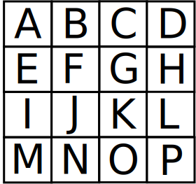

# About
Astrid is a solver for the currently popular Facebook Messenger game "Word
Blitz". Astrid generates solutions for Word Blitz provided with sixteen
letters that match the same arrangement of the Word Blitz puzzle.

Possible words are generated by using each letter as a starting point and then
traversing the grid of letters by moving to the next adjacent letter. After
each move, the total letters traversed thus far are checked against an English
lexis in order to determine if the current collection of letters makes a valid
word or not.

## Executing
After building, type `./astrid` to execute the solver. You will be presented
with a prompt where you must type sixteen letters that represent the Word Blitz
puzzle. Type the letters as the appear in Word Blitz row by row from top to
bottom. After typing press enter.

Astrid should output 16 columns of text with each column headed by the rank
of the letter as it appeared in the original puzzle. Each column consists of
the possible words that can be formed starting from that letter.

If the letter grid is like the image below; the input would be
"abcdefghijklmnop"

### Commands
If the word `test` is typed the letters used will be the first 16 letters of
the English alphabet.

## Configuring
At startup Astrid loads a configuration file (`config.conf`) which contains
some options that can be modified. A description of the options along with
their default values are in the table below.

Option               |                 Description                           | Default
---------------------|-------------------------------------------------------|---------
`maxWordLength`      |  Most letters a word should have                      | 9                        
`minWordLength`      |  Least letters a word should have                     | 3
`maxWordsPerRow`     |  Number of words shown before repeating column header | 15  
`wordColumnsPerRow`  |  Number of columns of words to show per row           | 16
`sortDescending`     |  Sort words in descending order                       | True
`enableHighlighting` |  Highlight word columns and words with rare letters   | True
`highlightLetters`   |  Words containing these letters are highlighted.      | xqzjy
`lexisFilePath`      |  Path to file with list of words                      | lexis

The default options should be fine on most systems. If your display is small
and/or does not support coloured text, adjust values of `maxWordsPerRow`,
`wordColumnsPerRow` and `enableHighlighting` respectively.

## Miscellaneous  
The data structure used to store the lexis is a Trie. While this is a fairly
efficient data structure for the words, a more space-efficient structure such
as a radix trie can be used.  Such an implementation change should be trivial
since the code is quite loosely coupled. So feel free to make this change
yourself if necessary. Otherwise I'll get to it sometime later when I have more
time :-). 

Last Modified Mon 18 Feb 10:34:16 GMT 2019
